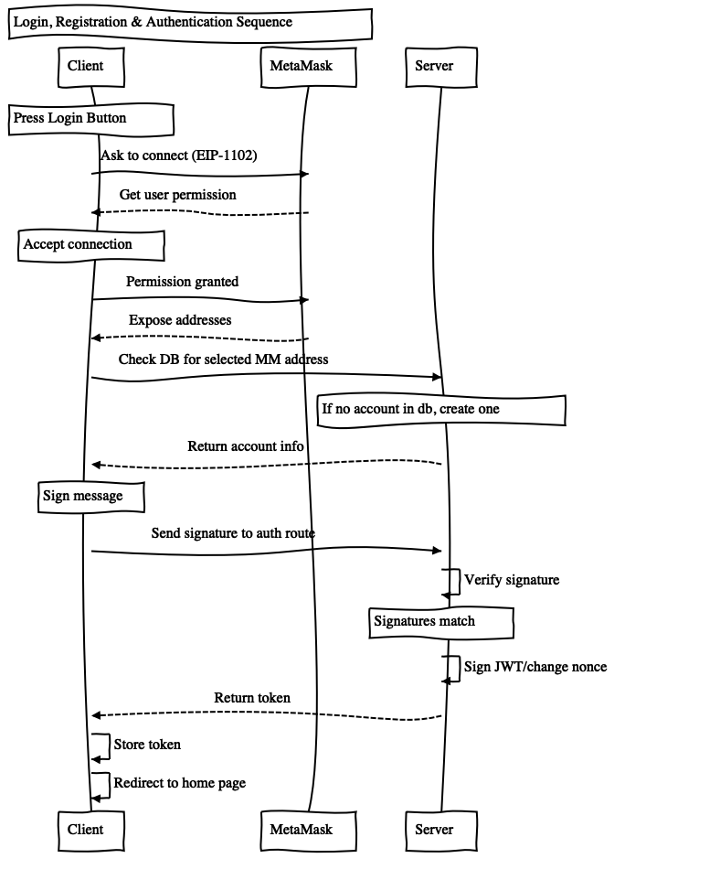
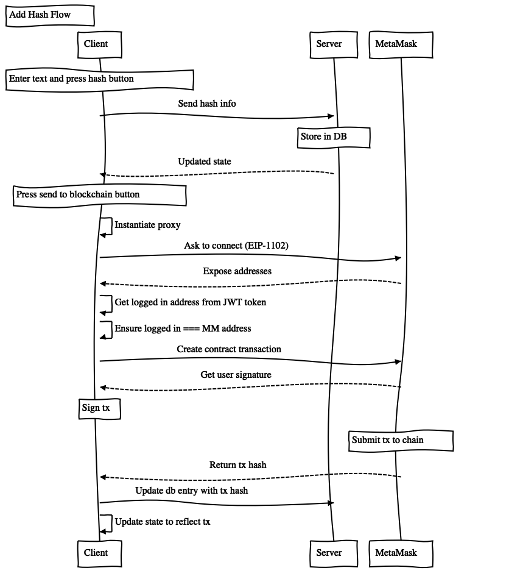
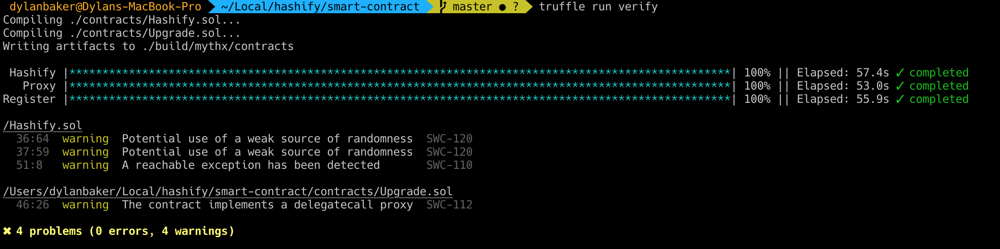
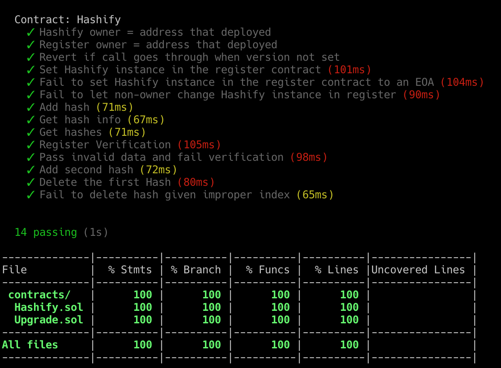

# Front End

#### `Authentication Flow`

#### `Add Hash Flow`

# Smart Contracts

### 100% Test Coverage and 0 Static-Analysis Issues (false positives for using block.number)

#### `Ropsten`

Hashify.sol - 0x03a3e58217207C0821Ba20Bce37996188a943E16

Register.sol - 0xCDFB66514b5e5AE8B58783bEBCEB45C8E1c88987

Proxy.sol - 0xdF5AeE5EBd82A0ebCc1056713724ef0E106c4E41

