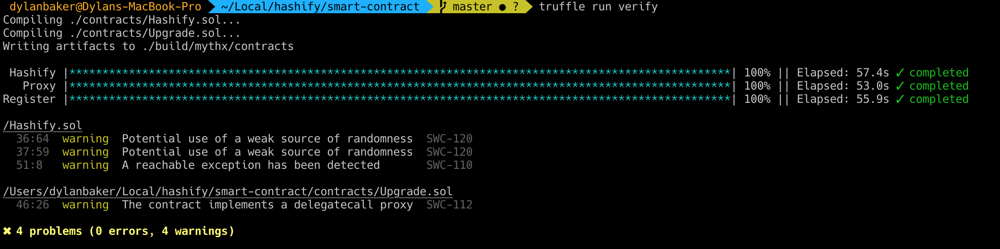
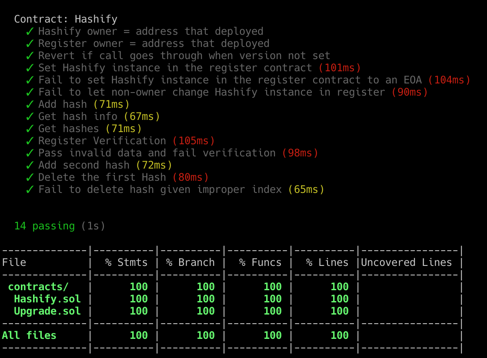

### 100% Test Coverage and 0 Static-Analysis Issues (false positive warnings for block.number)

To run smart contract analysis/tests `cd smart-contract` and do the following

`truffle verify` for static analysis
`npm i` then `npm run coverage` for tests

### To run Hashify simply `cd hashify` and run `npm i` and `npm start`

This starts the backend server and links to database, opens the frontend client in the browser

